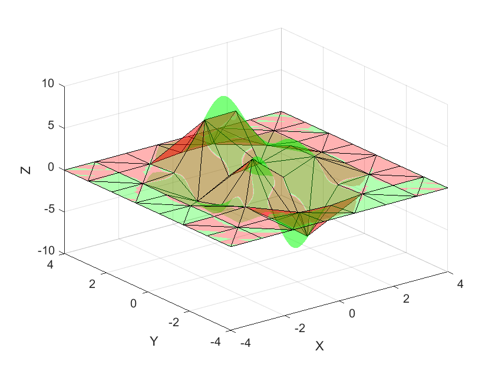
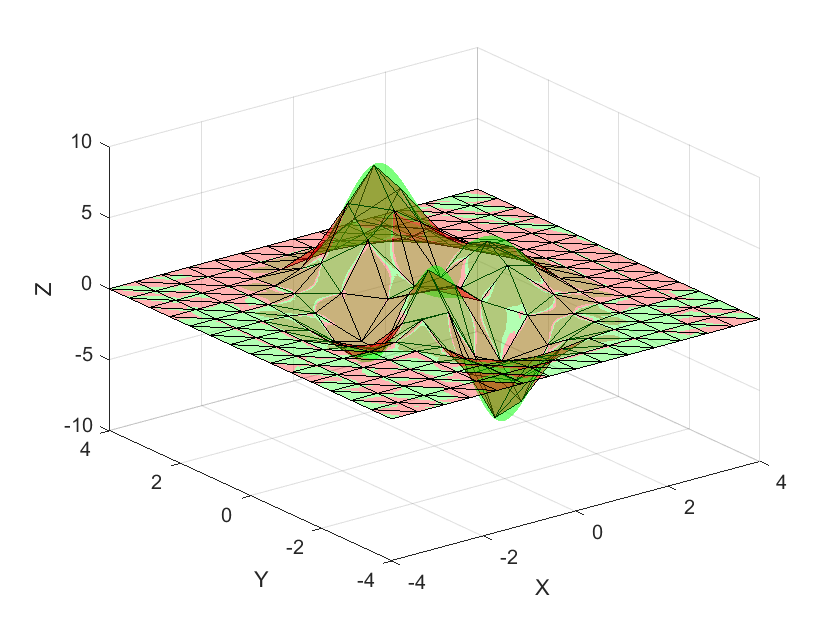

# Optimization over Non-Linear Non-Convex functions: a linearization approach

Due to the difficulties in solving optimisation problems with non-linear constraints, a popular approach is lower the problem complexity by linearization.

This repository presents a generic implementation in GAMS for linearising a bivariate function using various methods. The idea is that practitioners build their models around the code presented, so the linearisation model is encapsulated at a lower level. 

In addition, a Matlab script is provided for visualising generic bivariate functions and their triangulated versions.

    

    <em>Linearized function with 8 by 8 resolution and the J1 triangulation</em>

    

    <em>Linearized function with 15 by 15 resolution and the k1 triangulation</em>

**Supported methods:**

 - SOS2 based formulations: 
	 - Textbook formulation
	 - ZigZagInteger [Huchette 2019](https://doi.org/10.48550/arXiv.1708.00050)
- Babayev approach: [Babayev, 1997](https://doi.org/10.1007/BF00132502) 

The SOS2 formulations are implemented with the J1 and K1 triangulation.

**How to use:**

Let $z=f(x,y)$ be a continuous non-linear bivariate function (it can be non-convex), defined over the domain $[\underline{x},\overline{x}]\times [\underline{y},\overline{y}]$. The function
$f(x,y)$ can be piecewise linearized by performing a triangulation of the domain over which the function is defined and imposing that for points lying in between any given triangle, the function is approximated by the linear combination of its three vertices.

Parameters:
 - num_columns, num_rows: resolution of the triangularization region.
 - x_u,x_l,y_u,y_l, : upper and lower bounds of the domain ($[\underline{x},\overline{x}]\times [\underline{y},\overline{y}]$)
 - type_method: linearization method
	 - Zig-Zag Integer (1)
	 - Textbook formulation (2)
	 - Babeyev (3)
 - type_triangulation: triangulation pattern
	 - K1 triangulation (1)
	 - J1 triangulation (2)
 - f(x,y): function to linearize (defined in line 97 of the GAMS code)

**Performance comparasion**
The results presented in [1] showed that the Textbook formulation and the Zig-Zag Integer approach with the J1 triangulation gave the best performance. Nevertheless, the performance is highly dependent on the underlying linearised function, so practitioners are advised to analyse different methods and triangulations.

An explanation of the implemented methods and a detailed performance analysis are presented in the following paper:

[1] García-González, Javier, and Salvador Guerrero. ‘Optimal Management of a Microgrid Li-Ion Battery Considering Non-Linear Losses Using the Integer Zig-Zag Formulation’.  _Electric Power Systems Research_, vol. 235, 2024, p. 110776, https://doi.org10.1016/j.epsr.2024.110776.

<!-- CONTACT -->
## Contact

Salvador Guerrero García - salvadorgg@alu.comillas.edu - [LinkedIn](https://www.linkedin.com/in/salvador-guerrero-garcia/)

Javier García-González - javiergg@iit.comillas.edu

(<a href="#readme-top">back to top</a>)

